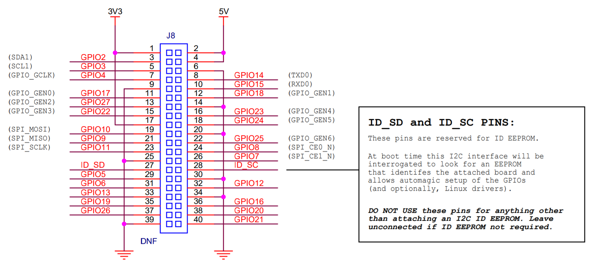

# README

个人认为，树莓派应该算是目前开源硬件里学习嵌入式Linux系统最好的工具，里面的设计思路和一些工具是很值得借鉴的，这里主要使用Raspberry Pi 4B进行系统架构分析。

## 40 Pin引脚

## Refers

## docs

NO.|文件名称|摘要
:--:|:--|:--
0016| [IoT网页GPIO控制LED](docs/0016_IoT网页GPIO控制LED.md) | 通过Python3 Flask作为HTTP服务端，控制GPIO
0015| [用户空间控制GPIO](docs/0015_用户空间控制GPIO.md) | 通过使用内核GPIO Sysfs Interface在用户空间控制LED
0014| [动态设备树GPIO控制LED](docs/0014_动态设备树GPIO控制LED.md) | 通过使用动态改变设备树，使用内核gpio-poweroff驱动实现LED控制
0013| [开机自动发IP信息邮件](docs/0013_开机自动发IP信息邮件.md) | Python3自动发邮件
0012| [dtparam_dtoverlay_DTS动态设备树](docs/0012_dtparam_dtoverlay_DTS动态设备树.md) | 分析dtparam/dtoverlay本质，为什么能够动态改变设备与驱动的match
0011| [SoC设备树DTS分析](docs/0011_SoC设备树DTS分析.md) | 怎么分析芯片设备树
0010| [Tmux_Vim_Ctags_Cscope代码分析](docs/0010_Tmux_Vim_Ctags_Cscope代码分析.md) | 在Linux命令行如何阅读代码？
0009| [USB摄像头搭建IP网络摄像头](docs/0009_USB摄像头搭建IP网络摄像头.md) | 使用USB Camera搭建IP Camera，理解IP Camera工作原理
0008| [USB摄像头分析udev加载驱动原理](docs/0008_USB摄像头分析udev加载驱动原理.md) | 使用USB Camera分析udev加载驱动原理，理解udev工作原理
0007| [Systemd进程启动](docs/0007_Systemd进程启动.md) | 分析Linux系统进程何启动起来
0006| [搭建samba服务端](docs/0006_搭建samba服务端.md) | 像访问普通文件夹一样访问树莓派文件系统
0005| [内核编译](docs/0005_内核编译.md) | 编译Linux内核，以备后续修改及分析驱动
0004| [Debug串口](docs/0004_Debug串口.md) | 看内核启动log信息，当机器无法启动可以判定问题
0003| [开源软件镜像站加速](docs/0003_开源软件镜像站加速.md) | 时间很宝贵，只介绍apt、pip镜像站，其他可自行扩展
0002| [USB_OTG虚拟网卡](docs/0002_USB_OTG虚拟网卡.md) | 在有些场合，没有Wifi想登陆树莓派，使用USB虚拟网卡SSH登陆
0001| [无屏如何使用树莓派](docs/0001_无屏如何使用树莓派.md) | 一个屏比一个树莓派还贵，不大可能为了玩个树莓派还单独买个屏，并不是每个人都有屏的需求
