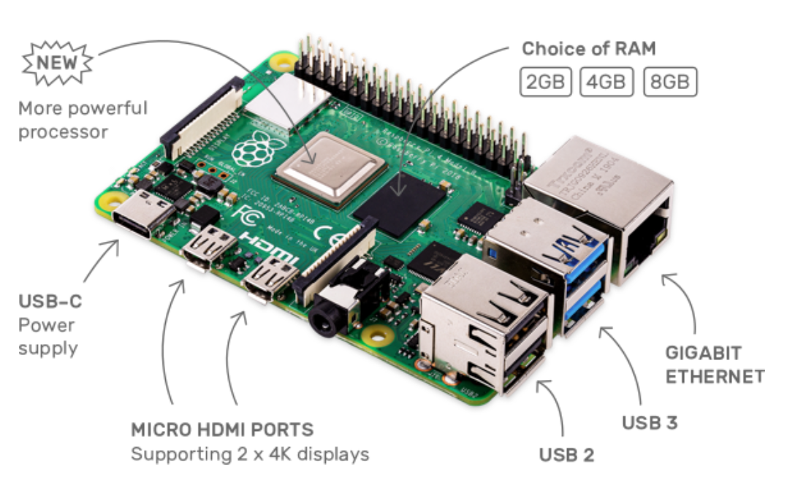
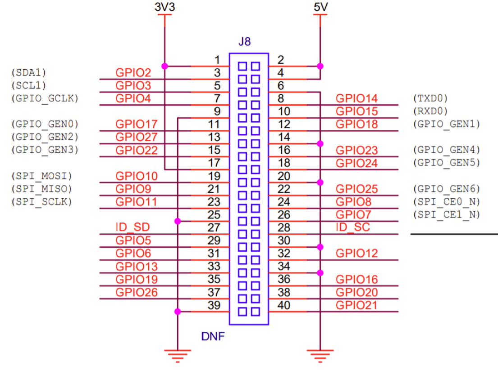
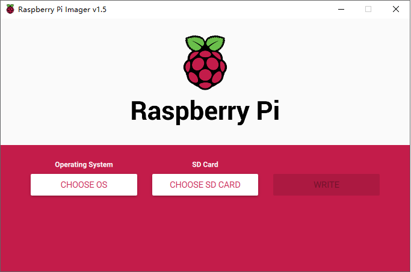
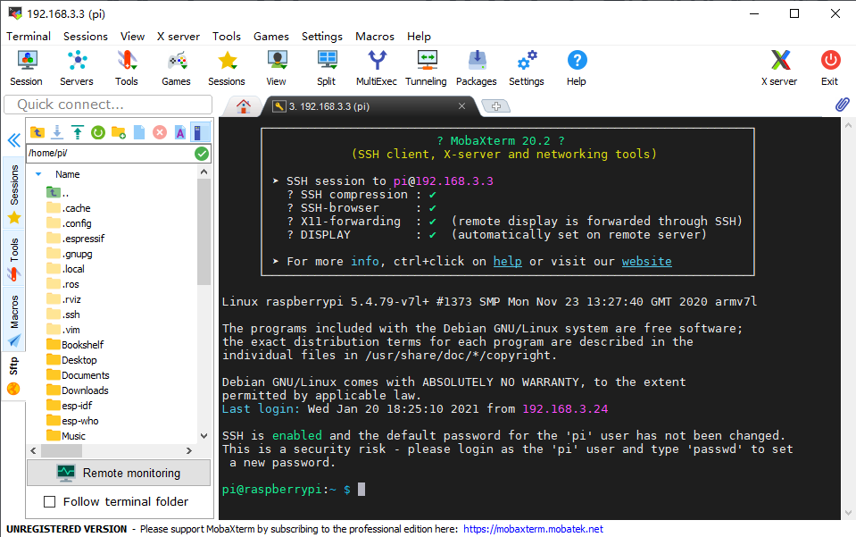

# 无屏怎么使用树莓派？

一个屏比一个树莓派还贵，不大可能为了玩个树莓派还单独买个屏，并不是每个人都有屏的需求


* [一、什么是树莓派](#一什么是树莓派)
* [二、安装树莓派官方系统](#二安装树莓派官方系统)
* [三、配置树莓派Wifi并开启SSH](#三配置树莓派Wifi并开启SSH)
* [四、MobaXterm SSH连接树莓派](#四MobaXterm-SSH连接树莓派)
* [五、远程桌面](#五远程桌面)


## 一、什么是树莓派

* 官方网址：https://www.raspberrypi.org/
* Raspberry Pi 4 Model B






## 二、安装树莓派官方系统

* 官方下载工具网址：https://www.raspberrypi.org/software/
* Raspberry Pi Imager




## 三、配置树莓派Wifi并开启SSH

* 系统安装完成后重新插拔USB SD读卡器，会挂在FAT格式的boot分区
* 在boot分区根目录创建`wpa_supplicant.conf`文件，并写入
  ```
  ctrl_interface=DIR=/var/run/wpa_supplicant GROUP=netdev
  update_config=1
  country=CN
  
  network={
          ssid="your wifi ssid"
          psk="your wifi password"
          key_mgmt=WPA-PSK
  }
  ```
* 在boot分区根目录创建ssh.txt文件，空文件就行
* 为什么这么做可以配置Wifi和SSH，原因后续解读


## 四、MobaXterm SSH连接树莓派

* 查看树莓派IP
  * 登陆路由器查看新登录的设备IP，等一小会
* 登陆树莓派
  * 用户：pi
  * 密码：raspberry



## 五、远程桌面

* sudo apt-get update
* sudo apt-get install xrdp
* Windows远程桌面输入账号密码登录
  * 用户：pi
  * 密码：raspberry
