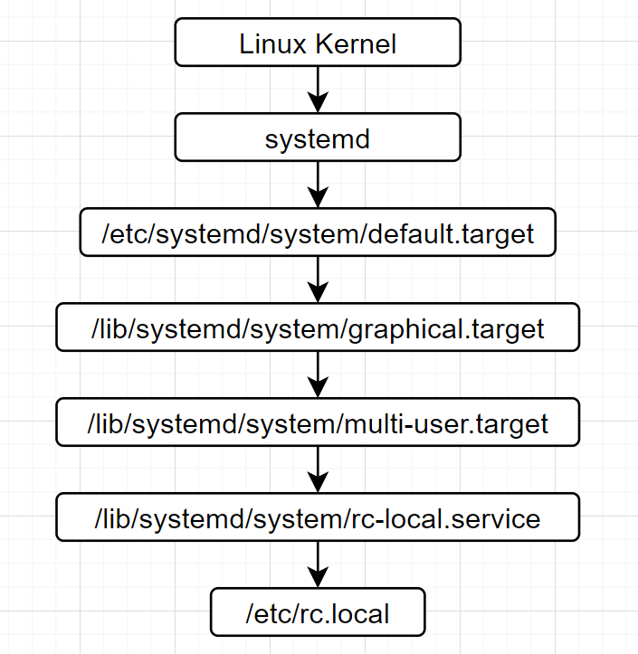

# Systemd进程启动

分析Linux系统进程何启动起来

## 参考文档

* [systemd (简体中文)](https://wiki.archlinux.org/index.php/Systemd_(%E7%AE%80%E4%BD%93%E4%B8%AD%E6%96%87))
* [udev (简体中文)](https://wiki.archlinux.org/index.php/Udev_(%E7%AE%80%E4%BD%93%E4%B8%AD%E6%96%87))
* https://www.raspberrypi.org/documentation/linux/usage/systemd.md
* https://www.raspberrypi.org/documentation/linux/usage/rc-local.md

## init真相

* stat /sbin/init
  ```
    File: /sbin/init -> /lib/systemd/systemd
    Size: 20              Blocks: 0          IO Block: 4096   symbolic link
  Device: b302h/45826d    Inode: 286014      Links: 1
  Access: (0777/lrwxrwxrwx)  Uid: (    0/    root)   Gid: (    0/    root)
  Access: 2021-01-11 13:31:33.086942487 +0000
  Modify: 2020-12-10 00:18:16.000000000 +0000
  Change: 2021-01-11 13:31:33.086942487 +0000
   Birth: -
  ```

## Systemd应用原理

在sysvinit中有明确定义的运行级别（如：0、1、3、5、6）与systemd中特定的 目标 存在一一对应的关系。然而，对于用户自定义运行级别（2、4）却没有。如需要同样功能，建议你以原有运行级别所对应的systemd目标为基础，新建一个/etc/systemd/system/\<目标名\>.target（可参考/usr/lib/systemd/system/graphical.target）, 然后创建目录/etc/systemd/system/\<目标名\>.wants，并向其中加入需启用的服务链接（指向/ur/lib/systemd/system/）。

**"SysV 运行级别" 与 "systemd 目标" 对照表**

SysV 运行级别 | Systemd 目标 | 注释
--|--|--
0               | runlevel0.target, poweroff.target     | 中断系统（halt）
1, s, single    | runlevel1.target, rescue.target       | 单用户模式
2, 4            | runlevel2.target, runlevel4.target, multi-user.target     | 用户自定义运行级别，通常识别为级别3。
3               | runlevel3.target, multi-user.target   | 多用户，无图形界面。用户可以通过终端或网络登录。
5               | runlevel5.target, graphical.target    | 多用户，图形界面。继承级别3的服务，并启动图形界面服务。
6               | runlevel6.target, reboot.target       | 重启
emergency       | emergency.target	                    | 急救模式（Emergency shell）

* systemctl get-default
  ```
  graphical.target
  ```
* cd /etc/systemd
* find * -iname default.target
  ```
  system/default.target
  ```
* ls -al system/default.target
  ```
  lrwxrwxrwx 1 root root 36 Jan 11 13:01 system/default.target -> /lib/systemd/system/graphical.target
  ```
* cat /lib/systemd/system/graphical.target
  ```
  # ...省略

  [Unit]
  Description=Graphical Interface
  Documentation=man:systemd.special(7)
  Requires=multi-user.target
  Wants=display-manager.service
  Conflicts=rescue.service rescue.target
  After=multi-user.target rescue.service rescue.target display-manager.service
  AllowIsolate=yes
  ```
  * Requires=multi-user.target

## rc.local启动分析

* systemctl status rc.local
  ```
  Warning: The unit file, source configuration file or drop-ins of rc-local.service changed on disk. Run 'systemctl daemon-reload' to reload units.
  ● rc-local.service - /etc/rc.local Compatibility
     Loaded: loaded (/lib/systemd/system/rc-local.service; enabled-runtime; vendor preset: enabled)
    Drop-In: /usr/lib/systemd/system/rc-local.service.d
             └─debian.conf
             /etc/systemd/system/rc-local.service.d
             └─ttyoutput.conf
     Active: active (exited) since Thu 2021-02-11 08:08:35 GMT; 6h ago
       Docs: man:systemd-rc-local-generator(8)
    Process: 461 ExecStart=/etc/rc.local start (code=exited, status=0/SUCCESS)
  
  Feb 11 08:08:35 raspberrypi systemd[1]: Starting /etc/rc.local Compatibility...
  Feb 11 08:08:35 raspberrypi systemd[1]: Started /etc/rc.local Compatibility.
  ```
  * Loaded: loaded (/lib/systemd/system/rc-local.service; enabled-runtime; vendor preset: enabled)
    * /lib/systemd/system/rc-local.service
  * Active: active (exited) since Thu 2021-02-11 08:08:35 GMT; 6h ago
* 

## Wifi配置启动分析

* /etc/systemd/system/multi-user.target.wants/raspberrypi-net-mods.service
  ```
  [Unit]
  Description=Copy user wpa_supplicant.conf
  ConditionPathExists=/boot/wpa_supplicant.conf
  Before=dhcpcd.service
  After=systemd-rfkill.service
  
  [Service]
  Type=oneshot
  RemainAfterExit=yes
  ExecStart=/bin/mv /boot/wpa_supplicant.conf /etc/wpa_supplicant/wpa_supplicant.conf
  ExecStartPost=/bin/chmod 600 /etc/wpa_supplicant/wpa_supplicant.conf
  ExecStartPost=/usr/sbin/rfkill unblock wifi
  
  [Install]
  WantedBy=multi-user.target
  ```

## SSH开启设置分析

* /etc/systemd/system/multi-user.target.wants/sshswitch.service
  ```
  [Unit]
  Description=Turn on SSH if /boot/ssh is present
  ConditionPathExistsGlob=/boot/ssh{,.txt}
  After=regenerate_ssh_host_keys.service
  
  [Service]
  Type=oneshot
  ExecStart=/bin/sh -c "systemctl enable --now ssh && rm -f /boot/ssh ; rm -f /boot/ssh.txt"
  
  [Install]
  WantedBy=multi-user.target
  ```

