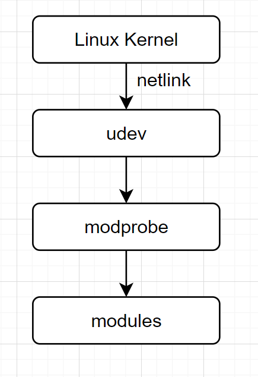

# USB摄像头分析udev加载驱动原理

使用USB Camera分析udev加载驱动原理，理解udev工作原理

## 参考文档

* [systemd (简体中文)](https://wiki.archlinux.org/index.php/Systemd_(%E7%AE%80%E4%BD%93%E4%B8%AD%E6%96%87))
* [udev (简体中文)](https://wiki.archlinux.org/index.php/Udev_(%E7%AE%80%E4%BD%93%E4%B8%AD%E6%96%87))
* [使用 udev 进行动态内核设备管理](https://documentation.suse.com/zh-cn/sles/12-SP3/html/SLES-all/cha-udev.html)

## UVC Driver

* make menuconfig
  * Device Drivers -> Multimedia support -> Media USB Adapters -> <*> USB Video Class (UVC)
* 以module的形式存在，如何被加载的呢？

## udev介绍

udev是Linux内核的设备管理器。总的来说，它取代了devfs和hotplug，负责管理/dev中的设备节点。同时，udev也处理所有用户空间发生的硬件添加、删除事件，以及某些特定设备所需的固件加载。

udev现在是systemd的组成部分，默认已安装。

udev规则以管理员身份编写并保存在/etc/udev/rules.d/目录，其文件名必须以.rules结尾。各种软件包提供的规则文件位于/lib/udev/rules.d/。如果/usr/lib和/etc这两个目录中有同名文件，则/etc中的文件优先。

## 分析USB Camera插入后处理过程

* cat /etc/udev/udev.conf
  ```
  # see udev.conf(5) for details
  #
  # udevd is also started in the initrd.  When this file is modified you might
  # also want to rebuild the initrd, so that it will include the modified configuration.
  
  #udev_log=info
  #children_max=
  #exec_delay=
  #event_timeout=180
  #resolve_names=early
  ```
  * udev_log=debug
* lsmod | grep uvc
* 插入USB Camera
* tail -f /var/log/debug
  ```
  Feb 12 00:27:03 raspberrypi systemd-udevd[147]: 1-1.3: Device (SEQNUM=1637, ACTION=add) is queued
  Feb 12 00:27:03 raspberrypi systemd-udevd[147]: Validate module index
  Feb 12 00:27:03 raspberrypi systemd-udevd[147]: Check if link configuration needs reloading.
  Feb 12 00:27:03 raspberrypi systemd-udevd[147]: Successfully forked off 'n/a' as PID 739.
  Feb 12 00:27:03 raspberrypi systemd-udevd[147]: 1-1.3: Worker [739] is forked for processing SEQNUM=1637.
  Feb 12 00:27:03 raspberrypi systemd-udevd[739]: 1-1.3: Processing device (SEQNUM=1637, ACTION=add)
  Feb 12 00:27:03 raspberrypi systemd-udevd[739]: 1-1.3: IMPORT builtin 'usb_id' /usr/lib/udev/rules.d/50-udev-default.rules:13
  Feb 12 00:27:03 raspberrypi systemd-udevd[739]: 1-1.3: IMPORT builtin 'hwdb' /usr/lib/udev/rules.d/50-udev-default.rules:13
  Feb 12 00:27:03 raspberrypi systemd-udevd[147]: 1-1.3:1.0: Device (SEQNUM=1638, ACTION=add) is queued
  Feb 12 00:27:03 raspberrypi systemd-udevd[147]: 1-1.3:1.1: Device (SEQNUM=1639, ACTION=add) is queued
  Feb 12 00:27:03 raspberrypi systemd-udevd[147]: 1-1.3: Device (SEQNUM=1640, ACTION=bind) is queued
  Feb 12 00:27:03 raspberrypi systemd-udevd[739]: 1-1.3: MODE 0664 /usr/lib/udev/rules.d/50-udev-default.rules:45
  Feb 12 00:27:03 raspberrypi systemd-udevd[739]: 1-1.3: PROGRAM 'mtp-probe /sys/devices/platform/scb/fd500000.pcie/pci0000:00/0000:00:00.0/0000:01:00.0/usb1/1-1/1-1.3 1 3' /usr/lib/udev/rules.d/69-libmtp.rules:2541
  Feb 12 00:27:03 raspberrypi systemd-udevd[739]: Starting 'mtp-probe /sys/devices/platform/scb/fd500000.pcie/pci0000:00/0000:00:00.0/0000:01:00.0/usb1/1-1/1-1.3 1 3'
  Feb 12 00:27:03 raspberrypi systemd-udevd[739]: Successfully forked off '(spawn)' as PID 740.
  Feb 12 00:27:03 raspberrypi systemd-udevd[739]: 'mtp-probe /sys/devices/platform/scb/fd500000.pcie/pci0000:00/0000:00:00.0/0000:01:00.0/usb1/1-1/1-1.3 1 3'(out) '0'
  Feb 12 00:27:03 raspberrypi systemd-udevd[739]: Process 'mtp-probe /sys/devices/platform/scb/fd500000.pcie/pci0000:00/0000:00:00.0/0000:01:00.0/usb1/1-1/1-1.3 1 3' succeeded.
  Feb 12 00:27:03 raspberrypi systemd-udevd[739]: 1-1.3: Handling device node '/dev/bus/usb/001/003', devnum=c189:2, mode=0664, uid=0, gid=0
  Feb 12 00:27:03 raspberrypi systemd-udevd[739]: 1-1.3: Setting permissions /dev/bus/usb/001/003, 020664, uid=0, gid=0
  Feb 12 00:27:03 raspberrypi systemd-udevd[739]: 1-1.3: Creating symlink '/dev/char/189:2' to '../bus/usb/001/003'
  Feb 12 00:27:03 raspberrypi systemd-udevd[739]: 1-1.3: sd-device: Created db file '/run/udev/data/c189:2' for '/devices/platform/scb/fd500000.pcie/pci0000:00/0000:00:00.0/0000:01:00.0/usb1/1-1/1-1.3'
  Feb 12 00:27:03 raspberrypi systemd-udevd[739]: 1-1.3: Device (SEQNUM=1637, ACTION=add) processed
  Feb 12 00:27:03 raspberrypi systemd-udevd[739]: 1-1.3: sd-device-monitor: Passed 632 byte to netlink monitor
  Feb 12 00:27:03 raspberrypi systemd-udevd[147]: 1-1.3:1.0: sd-device-monitor: Passed 341 byte to netlink monitor
  Feb 12 00:27:03 raspberrypi systemd-udevd[739]: 1-1.3:1.0: Processing device (SEQNUM=1638, ACTION=add)
  Feb 12 00:27:03 raspberrypi systemd-udevd[147]: Successfully forked off 'n/a' as PID 741.
  Feb 12 00:27:03 raspberrypi systemd-udevd[147]: 1-1.3:1.1: Worker [741] is forked for processing SEQNUM=1639.
  Feb 12 00:27:03 raspberrypi systemd-udevd[739]: 1-1.3:1.0: IMPORT builtin 'hwdb' /usr/lib/udev/rules.d/50-udev-default.rules:14
  Feb 12 00:27:03 raspberrypi systemd-udevd[739]: 1-1.3:1.0: IMPORT builtin 'usb_id' /usr/lib/udev/rules.d/60-libgphoto2-6.rules:9
  Feb 12 00:27:03 raspberrypi systemd-udevd[741]: 1-1.3:1.1: Processing device (SEQNUM=1639, ACTION=add)
  Feb 12 00:27:03 raspberrypi systemd-udevd[741]: 1-1.3:1.1: IMPORT builtin 'hwdb' /usr/lib/udev/rules.d/50-udev-default.rules:14
  Feb 12 00:27:03 raspberrypi systemd-udevd[741]: 1-1.3:1.1: IMPORT builtin 'usb_id' /usr/lib/udev/rules.d/60-libgphoto2-6.rules:9
  Feb 12 00:27:03 raspberrypi systemd-udevd[739]: 1-1.3:1.0: Failed to access usb_interface: No such file or directory
  Feb 12 00:27:03 raspberrypi systemd-udevd[739]: 1-1.3:1.0: IMPORT builtin 'usb_id' fails: No such file or directory
  Feb 12 00:27:03 raspberrypi systemd-udevd[741]: 1-1.3:1.1: Failed to access usb_interface: No such file or directory
  Feb 12 00:27:03 raspberrypi systemd-udevd[741]: 1-1.3:1.1: IMPORT builtin 'usb_id' fails: No such file or directory
  Feb 12 00:27:03 raspberrypi systemd-udevd[739]: 1-1.3:1.0: RUN 'kmod load $env{MODALIAS}' /usr/lib/udev/rules.d/80-drivers.rules:5
  Feb 12 00:27:03 raspberrypi systemd-udevd[741]: 1-1.3:1.1: RUN 'kmod load $env{MODALIAS}' /usr/lib/udev/rules.d/80-drivers.rules:5
  Feb 12 00:27:03 raspberrypi systemd-udevd[739]: 1-1.3:1.0: sd-device: Created db file '/run/udev/data/+usb:1-1.3:1.0' for '/devices/platform/scb/fd500000.pcie/pci0000:00/0000:00:00.0/0000:01:00.0/usb1/1-1/1-1.3/1-1.3:1.0'
  Feb 12 00:27:03 raspberrypi systemd-udevd[739]: Loading module: usb:v057Ep030Ad0924dcEFdsc02dp01ic0Eisc01ip00in00
  Feb 12 00:27:03 raspberrypi systemd-udevd[741]: 1-1.3:1.1: sd-device: Created db file '/run/udev/data/+usb:1-1.3:1.1' for '/devices/platform/scb/fd500000.pcie/pci0000:00/0000:00:00.0/0000:01:00.0/usb1/1-1/1-1.3/1-1.3:1.1'
  Feb 12 00:27:03 raspberrypi systemd-udevd[741]: Loading module: usb:v057Ep030Ad0924dcEFdsc02dp01ic0Eisc02ip00in01
  Feb 12 00:27:03 raspberrypi systemd-udevd[741]: Failed to find module 'usb:v057Ep030Ad0924dcEFdsc02dp01ic0Eisc02ip00in01'
  Feb 12 00:27:03 raspberrypi systemd-udevd[741]: 1-1.3:1.1: Device (SEQNUM=1639, ACTION=add) processed
  Feb 12 00:27:03 raspberrypi systemd-udevd[741]: 1-1.3:1.1: sd-device-monitor: Passed 483 byte to netlink monitor
  Feb 12 00:27:03 raspberrypi systemd-udevd[147]: uvcvideo: Device (SEQNUM=1641, ACTION=add) is queued
  Feb 12 00:27:03 raspberrypi systemd-udevd[147]: uvcvideo: sd-device-monitor: Passed 132 byte to netlink monitor
  Feb 12 00:27:03 raspberrypi systemd-udevd[741]: uvcvideo: Processing device (SEQNUM=1641, ACTION=add)
  Feb 12 00:27:03 raspberrypi systemd-udevd[147]: 1-1.3:1.1: Device (SEQNUM=1642, ACTION=bind) is queued
  Feb 12 00:27:03 raspberrypi systemd-udevd[741]: uvcvideo: Device (SEQNUM=1641, ACTION=add) processed
  Feb 12 00:27:03 raspberrypi systemd-udevd[741]: uvcvideo: sd-device-monitor: Passed 132 byte to netlink monitor
  Feb 12 00:27:03 raspberrypi systemd-udevd[147]: video0: Device (SEQNUM=1643, ACTION=add) is queued
  Feb 12 00:27:03 raspberrypi systemd-udevd[147]: video1: Device (SEQNUM=1644, ACTION=add) is queued
  Feb 12 00:27:03 raspberrypi systemd-udevd[147]: media2: Device (SEQNUM=1645, ACTION=add) is queued
  Feb 12 00:27:03 raspberrypi systemd-udevd[147]: input0: Device (SEQNUM=1646, ACTION=add) is queued
  Feb 12 00:27:03 raspberrypi systemd-udevd[147]: event0: Device (SEQNUM=1647, ACTION=add) is queued
  Feb 12 00:27:03 raspberrypi systemd-udevd[739]: Inserted module 'uvcvideo'
  Feb 12 00:27:03 raspberrypi systemd-udevd[739]: 1-1.3:1.0: Device (SEQNUM=1638, ACTION=add) processed
  Feb 12 00:27:03 raspberrypi systemd-udevd[739]: 1-1.3:1.0: sd-device-monitor: Passed 483 byte to netlink monitor
  Feb 12 00:27:03 raspberrypi systemd-udevd[147]: 1-1.3:1.0: Device (SEQNUM=1648, ACTION=bind) is queued
  Feb 12 00:27:03 raspberrypi systemd-udevd[147]: 1-1.3: sd-device-monitor: Passed 333 byte to netlink monitor
  Feb 12 00:27:03 raspberrypi systemd-udevd[741]: 1-1.3: Processing device (SEQNUM=1640, ACTION=bind)
  Feb 12 00:27:03 raspberrypi systemd-udevd[147]: uvcvideo: Device (SEQNUM=1649, ACTION=add) is queued
  Feb 12 00:27:03 raspberrypi systemd-udevd[147]: uvcvideo: sd-device-monitor: Passed 142 byte to netlink monitor
  Feb 12 00:27:03 raspberrypi systemd-udevd[739]: uvcvideo: Processing device (SEQNUM=1649, ACTION=add)
  Feb 12 00:27:03 raspberrypi systemd-udevd[741]: 1-1.3: IMPORT builtin 'usb_id' /usr/lib/udev/rules.d/50-udev-default.rules:13
  Feb 12 00:27:03 raspberrypi systemd-udevd[741]: 1-1.3: IMPORT builtin 'hwdb' /usr/lib/udev/rules.d/50-udev-default.rules:13
  Feb 12 00:27:03 raspberrypi systemd-udevd[739]: uvcvideo: Device (SEQNUM=1649, ACTION=add) processed
  Feb 12 00:27:03 raspberrypi systemd-udevd[739]: uvcvideo: sd-device-monitor: Passed 142 byte to netlink monitor
  Feb 12 00:27:03 raspberrypi systemd-udevd[741]: 1-1.3: PROGRAM 'mtp-probe /sys/devices/platform/scb/fd500000.pcie/pci0000:00/0000:00:00.0/0000:01:00.0/usb1/1-1/1-1.3 1 3' /usr/lib/udev/rules.d/69-libmtp.rules:2541
  Feb 12 00:27:03 raspberrypi systemd-udevd[741]: Starting 'mtp-probe /sys/devices/platform/scb/fd500000.pcie/pci0000:00/0000:00:00.0/0000:01:00.0/usb1/1-1/1-1.3 1 3'
  Feb 12 00:27:03 raspberrypi systemd-udevd[741]: Successfully forked off '(spawn)' as PID 742.
  Feb 12 00:27:03 raspberrypi systemd-udevd[741]: 'mtp-probe /sys/devices/platform/scb/fd500000.pcie/pci0000:00/0000:00:00.0/0000:01:00.0/usb1/1-1/1-1.3 1 3'(out) '0'
  Feb 12 00:27:03 raspberrypi systemd-udevd[741]: Process 'mtp-probe /sys/devices/platform/scb/fd500000.pcie/pci0000:00/0000:00:00.0/0000:01:00.0/usb1/1-1/1-1.3 1 3' succeeded.
  Feb 12 00:27:03 raspberrypi systemd-udevd[741]: 1-1.3: Handling device node '/dev/bus/usb/001/003', devnum=c189:2, mode=0600, uid=0, gid=0
  Feb 12 00:27:03 raspberrypi systemd-udevd[741]: 1-1.3: Preserve already existing symlink '/dev/char/189:2' to '../bus/usb/001/003'
  Feb 12 00:27:03 raspberrypi systemd-udevd[741]: 1-1.3: sd-device: Created db file '/run/udev/data/c189:2' for '/devices/platform/scb/fd500000.pcie/pci0000:00/0000:00:00.0/0000:01:00.0/usb1/1-1/1-1.3'
  Feb 12 00:27:03 raspberrypi systemd-udevd[741]: 1-1.3: Device (SEQNUM=1640, ACTION=bind) processed
  Feb 12 00:27:03 raspberrypi systemd-udevd[741]: 1-1.3: sd-device-monitor: Passed 633 byte to netlink monitor
  Feb 12 00:27:03 raspberrypi systemd-udevd[741]: 1-1.3:1.1: Processing device (SEQNUM=1642, ACTION=bind)
  Feb 12 00:27:03 raspberrypi systemd-udevd[147]: 1-1.3:1.1: sd-device-monitor: Passed 358 byte to netlink monitor
  Feb 12 00:27:03 raspberrypi systemd-udevd[147]: video0: sd-device-monitor: Passed 274 byte to netlink monitor
  Feb 12 00:27:03 raspberrypi systemd-udevd[741]: 1-1.3:1.1: IMPORT builtin 'hwdb' /usr/lib/udev/rules.d/50-udev-default.rules:14
  Feb 12 00:27:03 raspberrypi systemd-udevd[741]: 1-1.3:1.1: IMPORT builtin 'usb_id' /usr/lib/udev/rules.d/60-libgphoto2-6.rules:9
  Feb 12 00:27:03 raspberrypi systemd-udevd[147]: Successfully forked off 'n/a' as PID 743.
  Feb 12 00:27:03 raspberrypi systemd-udevd[147]: video1: Worker [743] is forked for processing SEQNUM=1644.
  Feb 12 00:27:03 raspberrypi systemd-udevd[147]: Successfully forked off 'n/a' as PID 744.
  Feb 12 00:27:03 raspberrypi systemd-udevd[743]: video1: Processing device (SEQNUM=1644, ACTION=add)
  Feb 12 00:27:03 raspberrypi systemd-udevd[147]: media2: Worker [744] is forked for processing SEQNUM=1645.
  Feb 12 00:27:03 raspberrypi systemd-udevd[147]: Successfully forked off 'n/a' as PID 745.
  Feb 12 00:27:03 raspberrypi systemd-udevd[741]: 1-1.3:1.1: Failed to access usb_interface: No such file or directory
  Feb 12 00:27:03 raspberrypi systemd-udevd[741]: 1-1.3:1.1: IMPORT builtin 'usb_id' fails: No such file or directory
  Feb 12 00:27:03 raspberrypi systemd-udevd[147]: input0: Worker [745] is forked for processing SEQNUM=1646.
  Feb 12 00:27:03 raspberrypi systemd-udevd[739]: video0: Processing device (SEQNUM=1643, ACTION=add)
  Feb 12 00:27:03 raspberrypi systemd-udevd[741]: 1-1.3:1.1: sd-device: Created db file '/run/udev/data/+usb:1-1.3:1.1' for '/devices/platform/scb/fd500000.pcie/pci0000:00/0000:00:00.0/0000:01:00.0/usb1/1-1/1-1.3/1-1.3:1.1'
  Feb 12 00:27:03 raspberrypi systemd-udevd[741]: 1-1.3:1.1: Device (SEQNUM=1642, ACTION=bind) processed
  Feb 12 00:27:03 raspberrypi systemd-udevd[741]: 1-1.3:1.1: sd-device-monitor: Passed 500 byte to netlink monitor
  Feb 12 00:27:03 raspberrypi systemd-udevd[743]: video1: GROUP 44 /usr/lib/udev/rules.d/50-udev-default.rules:32
  Feb 12 00:27:03 raspberrypi systemd-udevd[743]: video1: IMPORT 'v4l_id /dev/video1' /usr/lib/udev/rules.d/60-persistent-v4l.rules:7
  Feb 12 00:27:03 raspberrypi systemd-udevd[743]: Starting 'v4l_id /dev/video1'
  Feb 12 00:27:03 raspberrypi systemd-udevd[744]: media2: Processing device (SEQNUM=1645, ACTION=add)
  Feb 12 00:27:03 raspberrypi systemd-udevd[743]: Successfully forked off '(spawn)' as PID 746.
  Feb 12 00:27:03 raspberrypi systemd-udevd[745]: input0: Processing device (SEQNUM=1646, ACTION=add)
  Feb 12 00:27:03 raspberrypi systemd-udevd[745]: input0: IMPORT builtin 'hwdb' /usr/lib/udev/rules.d/50-udev-default.rules:14
  Feb 12 00:27:03 raspberrypi systemd-udevd[744]: media2: GROUP 44 /usr/lib/udev/rules.d/50-udev-default.rules:36
  Feb 12 00:27:03 raspberrypi systemd-udevd[739]: video0: GROUP 44 /usr/lib/udev/rules.d/50-udev-default.rules:32
  Feb 12 00:27:03 raspberrypi systemd-udevd[744]: media2: Handling device node '/dev/media2', devnum=c235:2, mode=0660, uid=0, gid=44
  Feb 12 00:27:03 raspberrypi systemd-udevd[739]: video0: IMPORT 'v4l_id /dev/video0' /usr/lib/udev/rules.d/60-persistent-v4l.rules:7
  Feb 12 00:27:03 raspberrypi systemd-udevd[744]: media2: Setting permissions /dev/media2, 020660, uid=0, gid=44
  Feb 12 00:27:03 raspberrypi systemd-udevd[739]: Starting 'v4l_id /dev/video0'
  Feb 12 00:27:03 raspberrypi systemd-udevd[744]: media2: Creating symlink '/dev/char/235:2' to '../media2'
  Feb 12 00:27:03 raspberrypi systemd-udevd[744]: media2: sd-device: Created empty file '/run/udev/data/c235:2' for '/devices/platform/scb/fd500000.pcie/pci0000:00/0000:00:00.0/0000:01:00.0/usb1/1-1/1-1.3/1-1.3:1.0/media2'
  Feb 12 00:27:03 raspberrypi systemd-udevd[744]: media2: Device (SEQNUM=1645, ACTION=add) processed
  Feb 12 00:27:03 raspberrypi systemd-udevd[744]: media2: sd-device-monitor: Passed 257 byte to netlink monitor
  Feb 12 00:27:03 raspberrypi systemd-udevd[739]: Successfully forked off '(spawn)' as PID 747.
  Feb 12 00:27:03 raspberrypi systemd-udevd[745]: input0: No entry found from hwdb.
  Feb 12 00:27:03 raspberrypi systemd-udevd[745]: input0: IMPORT builtin 'hwdb' fails: No data available
  Feb 12 00:27:03 raspberrypi systemd-udevd[745]: input0: IMPORT builtin 'input_id' /usr/lib/udev/rules.d/60-input-id.rules:5
  Feb 12 00:27:03 raspberrypi systemd-udevd[743]: 'v4l_id /dev/video1'(out) 'ID_V4L_VERSION=2'
  Feb 12 00:27:03 raspberrypi systemd-udevd[743]: 'v4l_id /dev/video1'(out) 'ID_V4L_PRODUCT=USB Camera: USB Camera'
  Feb 12 00:27:03 raspberrypi systemd-udevd[743]: 'v4l_id /dev/video1'(out) 'ID_V4L_CAPABILITIES=:capture:'
  Feb 12 00:27:03 raspberrypi systemd-udevd[743]: Process 'v4l_id /dev/video1' succeeded.
  Feb 12 00:27:03 raspberrypi systemd-udevd[745]: input0: capabilities/ev raw kernel attribute: 3
  Feb 12 00:27:03 raspberrypi systemd-udevd[743]: video1: IMPORT builtin 'usb_id' /usr/lib/udev/rules.d/60-persistent-v4l.rules:9
  Feb 12 00:27:03 raspberrypi systemd-udevd[745]: input0: capabilities/abs raw kernel attribute: 0
  Feb 12 00:27:03 raspberrypi systemd-udevd[743]: 1-1.3:1.0: if_class:14 protocol:0
  Feb 12 00:27:03 raspberrypi systemd-udevd[745]: input0: capabilities/rel raw kernel attribute: 0
  Feb 12 00:27:03 raspberrypi systemd-udevd[745]: input0: capabilities/key raw kernel attribute: 100000 0 0 0 0 0 0
  Feb 12 00:27:03 raspberrypi systemd-udevd[745]: input0: properties raw kernel attribute: 0
  Feb 12 00:27:03 raspberrypi systemd-udevd[745]: input0: test_key: checking bit block 0 for any keys; found=0
  Feb 12 00:27:03 raspberrypi systemd-udevd[745]: input0: test_key: checking bit block 32 for any keys; found=0
  Feb 12 00:27:03 raspberrypi systemd-udevd[745]: input0: test_key: checking bit block 64 for any keys; found=0
  Feb 12 00:27:03 raspberrypi systemd-udevd[745]: input0: test_key: checking bit block 96 for any keys; found=0
  Feb 12 00:27:03 raspberrypi systemd-udevd[745]: input0: test_key: checking bit block 128 for any keys; found=0
  Feb 12 00:27:03 raspberrypi systemd-udevd[745]: input0: test_key: checking bit block 160 for any keys; found=0
  Feb 12 00:27:03 raspberrypi systemd-udevd[745]: input0: test_key: checking bit block 192 for any keys; found=1
  Feb 12 00:27:03 raspberrypi systemd-udevd[745]: input0: test_key: checking bit block 224 for any keys; found=1
  Feb 12 00:27:03 raspberrypi systemd-udevd[745]: input0: IMPORT builtin 'hwdb' /usr/lib/udev/rules.d/60-input-id.rules:6
  Feb 12 00:27:03 raspberrypi systemd-udevd[745]: input0: No entry found from hwdb.
  Feb 12 00:27:03 raspberrypi systemd-udevd[743]: video1: LINK 'v4l/by-id/usb-Guillemot_Corporation_USB_Camera-video-index1' /usr/lib/udev/rules.d/60-persistent-v4l.rules:10
  Feb 12 00:27:03 raspberrypi systemd-udevd[743]: video1: IMPORT builtin 'path_id' /usr/lib/udev/rules.d/60-persistent-v4l.rules:16
  Feb 12 00:27:03 raspberrypi systemd-udevd[745]: input0: IMPORT builtin 'hwdb' fails: No data available
  Feb 12 00:27:03 raspberrypi systemd-udevd[743]: video1: LINK 'v4l/by-path/platform-fd500000.pcie-pci-0000:01:00.0-usb-0:1.3:1.0-video-index1' /usr/lib/udev/rules.d/60-persistent-v4l.rules:17
  Feb 12 00:27:03 raspberrypi systemd-udevd[743]: video1: RUN 'uaccess' /usr/lib/udev/rules.d/73-seat-late.rules:17
  Feb 12 00:27:03 raspberrypi systemd-udevd[745]: input0: IMPORT builtin 'usb_id' /usr/lib/udev/rules.d/60-persistent-input.rules:11
  Feb 12 00:27:03 raspberrypi systemd-udevd[743]: video1: Handling device node '/dev/video1', devnum=c81:8, mode=0660, uid=0, gid=44
  Feb 12 00:27:03 raspberrypi systemd-udevd[743]: video1: Setting permissions /dev/video1, 020660, uid=0, gid=44
  Feb 12 00:27:03 raspberrypi systemd-udevd[743]: video1: Creating symlink '/dev/char/81:8' to '../video1'
  Feb 12 00:27:03 raspberrypi systemd-udevd[743]: video1: Creating symlink '/dev/v4l/by-path/platform-fd500000.pcie-pci-0000:01:00.0-usb-0:1.3:1.0-video-index1' to '../../video1'
  Feb 12 00:27:03 raspberrypi systemd-udevd[743]: video1: Creating symlink '/dev/v4l/by-id/usb-Guillemot_Corporation_USB_Camera-video-index1' to '../../video1'
  Feb 12 00:27:03 raspberrypi systemd-udevd[745]: 1-1.3:1.0: if_class:14 protocol:0
  Feb 12 00:27:03 raspberrypi systemd-udevd[743]: video1: sd-device: Created db file '/run/udev/data/c81:8' for '/devices/platform/scb/fd500000.pcie/pci0000:00/0000:00:00.0/0000:01:00.0/usb1/1-1/1-1.3/1-1.3:1.0/video4linux/video1'
  Feb 12 00:27:03 raspberrypi systemd-udevd[743]: video1: Device (SEQNUM=1644, ACTION=add) processed
  Feb 12 00:27:03 raspberrypi systemd-udevd[743]: video1: sd-device-monitor: Passed 1097 byte to netlink monitor
  Feb 12 00:27:03 raspberrypi systemd-udevd[745]: input0: IMPORT builtin 'path_id' /usr/lib/udev/rules.d/60-persistent-input.rules:35
  Feb 12 00:27:03 raspberrypi systemd-udevd[745]: input0: RUN '/usr/sbin/th-cmd --socket /var/run/thd.socket --passfd --udev' /usr/lib/udev/rules.d/60-triggerhappy.rules:4
  Feb 12 00:27:03 raspberrypi systemd-udevd[739]: 'v4l_id /dev/video0'(out) 'ID_V4L_VERSION=2'
  Feb 12 00:27:03 raspberrypi systemd-udevd[739]: 'v4l_id /dev/video0'(out) 'ID_V4L_PRODUCT=USB Camera: USB Camera'
  Feb 12 00:27:03 raspberrypi systemd-udevd[739]: 'v4l_id /dev/video0'(out) 'ID_V4L_CAPABILITIES=:capture:'
  Feb 12 00:27:03 raspberrypi systemd-udevd[739]: Process 'v4l_id /dev/video0' succeeded.
  ...省略
  ```
  * `Feb 12 00:27:03 raspberrypi systemd-udevd[739]: 1-1.3:1.0: RUN 'kmod load $env{MODALIAS}' /usr/lib/udev/rules.d/80-drivers.rules:5`
    * /usr/lib/udev/rules.d/80-drivers.rules
      ```
      # do not edit this file, it will be overwritten on update
      
      ACTION!="add", GOTO="drivers_end"
      
      ENV{MODALIAS}=="?*", RUN{builtin}+="kmod load $env{MODALIAS}"
      SUBSYSTEM=="tifm", ENV{TIFM_CARD_TYPE}=="SD", RUN{builtin}+="kmod load tifm_sd"
      SUBSYSTEM=="tifm", ENV{TIFM_CARD_TYPE}=="MS", RUN{builtin}+="kmod load tifm_ms"
      SUBSYSTEM=="memstick", RUN{builtin}+="kmod load ms_block mspro_block"
      SUBSYSTEM=="i2o", RUN{builtin}+="kmod load i2o_block"
      SUBSYSTEM=="module", KERNEL=="parport_pc", RUN{builtin}+="kmod load ppdev"
      KERNEL=="mtd*ro", ENV{MTD_FTL}=="smartmedia", RUN{builtin}+="kmod load sm_ftl"
      
      LABEL="drivers_end"
      ```
    * vim /etc/init.d/kmod
      ```sh
      load_module() {
        local module args
        module="$1"
        args="$2"

        if [ "$VERBOSE" != no ]; then
          log_action_msg "Loading kernel module $module"
          modprobe $module $args || true
        else
          modprobe $module $args > /dev/null 2>&1 || true
        fi
      }
      ```
    * `Feb 12 00:27:03 raspberrypi systemd-udevd[739]: Loading module: usb:v057Ep030Ad0924dcEFdsc02dp01ic0Eisc01ip00in00`
    * `Feb 12 00:27:03 raspberrypi systemd-udevd[739]: Process 'v4l_id /dev/video0' succeeded.`
* lsmod | grep uvc
* 手动模拟插入模块：modprobe usb:v057Ep030Ad0924dcEFdsc02dp01ic0Eisc01ip00in00
  * grep uvcvideo /lib/modules/5.4.83-v7l/modules.alias
    ```
    alias usb:v*p*d*dc*dsc*dp*ic0Eisc01ip01in* uvcvideo
    alias usb:v*p*d*dc*dsc*dp*ic0Eisc01ip00in* uvcvideo
    # ...省略
    ```
  * vim drivers/media/usb/uvc/uvcvideo.mod.c
    ```
    # ...省略
    MODULE_ALIAS("usb:v2833p0201d*dc*dsc*dp*ic0Eisc01ip00in*");
    MODULE_ALIAS("usb:v2833p0211d*dc*dsc*dp*icFFisc01ip00in*");
    MODULE_ALIAS("usb:v29FEp4D53d*dc*dsc*dp*ic0Eisc01ip00in*");
    MODULE_ALIAS("usb:v8086p0B03d*dc*dsc*dp*ic0Eisc01ip00in*");
    MODULE_ALIAS("usb:v*p*d*dc*dsc*dp*ic0Eisc01ip00in*");
    MODULE_ALIAS("usb:v*p*d*dc*dsc*dp*ic0Eisc01ip01in*");
    
    MODULE_INFO(srcversion, "989D8E515BF6041C12EE9A5");
    ```

## 驱动加载流程



## netlink检测热插拔

* netlink是基于socket，并且是内核和用户进程都创建各自的socket，这样双方都使用基于socket的收发缓冲队列，这一点最大的好处是内核和用户进程都可以发起向对方发送消息，准确的说用户进程和内核进程(内核在系统中事实上也可以看做一个进程，其进程tgid为0)都可以是消息的发送者；
* https://github.com/ZengjfOS/RaspberryPi/blob/hotplug/main.c
