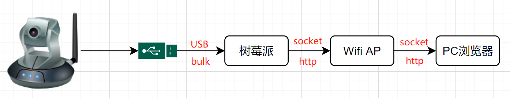

# USB摄像头搭建IP网络摄像头

使用USB Camera搭建IP Camera，理解IP Camera工作原理

## 参考文档

* [利用flask将opencv实时视频流输出到浏览器](https://www.cnblogs.com/arkenstone/p/7159615.html)
* [使用 multipart/x-mixed-replace 实现 http 实时视频流](https://segmentfault.com/a/1190000018563132)

## 简述

从USB摄像头获取视频帧(一张图片)，将视频帧传输到客户端(浏览器)，这里有很多成熟的传输技术，包括：HLS、RTSP、RTMP等。这些技术有一定的复杂性，各自有其适用场景，如果业务场景对实时性、性能没有太高要求，那显得有点牛刀杀鸡了。我们选择http的multipart类型，这是一个简单的方案，我们主要是理解架构：



## IP Camera实践

* cat /etc/pip.conf
  ```
  [global]
  timeout = 600
  index-url = https://pypi.tuna.tsinghua.edu.cn/simple
  extra-index-url = https://pypi.tuna.tsinghua.edu.cn/simple
  ```
* sudo pip3 install flask
  * Flask是一个使用Python编写的轻量级Web应用程序框架。
* sudo apt-get install cmake
* sudo pip3 install opencv-python
  * 安装时间挺长，挺住，编译源代码的时候好像只用了一个核，所以很慢，我这边安装了差不多一个半小时；
  * 可以通过top命令查看情况
* https://github.com/LowLevelOfLogic/RaspberryPi/tree/IP_Camera
  * [OpenCV人脸识别模型haarcascade_frontalface_alt.xml，模型来自这里](https://github.com/TimeIvyace/OpenCV-PCA-KNN-SVM_face_recognition)
