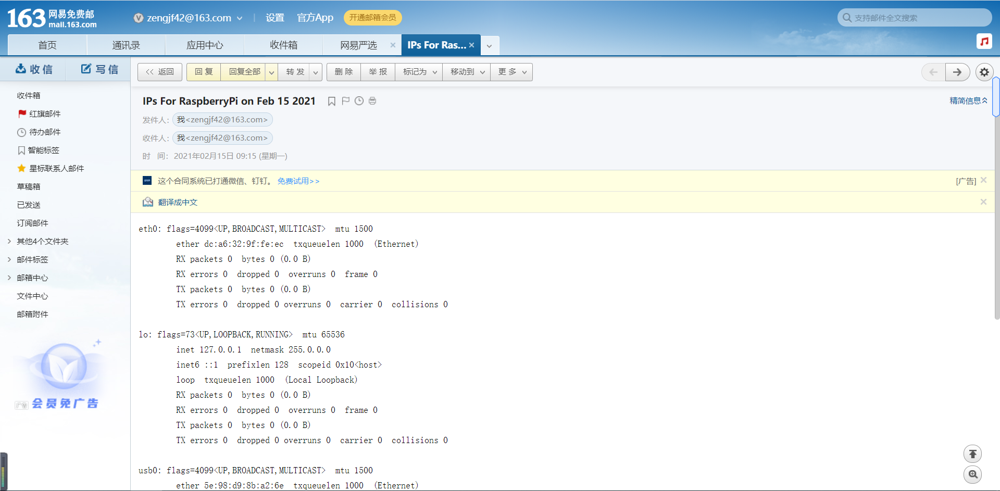

# 开机自动发IP信息邮件

Python3自动发邮件

## 163 SMTP授权密码

* [设置] -> [POP3/SMTP/IMAP] -> [开启服务] -> [IMAP/SMTP服务]

## automail

* automail/main.py
  ```python
  #!/usr/bin/python3
  
  import subprocess
  import smtplib
  from email.mime.text import MIMEText
  import datetime
  import time
  import os
  
  def check_ping():
      hostname = "www.baidu.com"
      response = os.system("ping -c 1 " + hostname)
  
      # and then check the response...
      if response == 0:
          pingstatus = True
      else:
          pingstatus = False
  
      return pingstatus
  
  while True:
      if check_ping():
          break
  
      time.sleep(1)
  
  # Change to your own account information
  # Account Information
  to            = 'zengjf42@163.com'           # Email to send to.
  mail_user     = 'zengjf42@163.com'           # Email to send from.
  mail_password = '<your smtp passwd>'          # Email password.
  smtpserver    = smtplib.SMTP('smtp.163.com') # Server to use.
  
  smtpserver.ehlo()                            # Says 'hello' to the server
  smtpserver.starttls()                        # Start TLS encryption
  smtpserver.ehlo()
  smtpserver.login(mail_user, mail_password)   # Log in to server
  today = datetime.date.today()                # Get current time/date
  
  arg='ifconfig -a'                            # Linux command to retrieve ip addresses.
  # Runs 'arg' in a 'hidden terminal'.
  p=subprocess.Popen(arg, shell=True, stdout=subprocess.PIPE)
  data = p.communicate()                       # Get data from 'p terminal'.
  # print(data)
  
  # get ip data
  ip_lines = data[0].splitlines()
  ips = ""
  for ip in ip_lines:
      ips += ip.decode("utf-8") + "\n"
  
  
  # Creates the text, subject, 'from', and 'to' of the message.
  msg = MIMEText(ips)
  msg['Subject'] = 'IPs For RaspberryPi on %s' % today.strftime('%b %d %Y')
  msg['From'] = mail_user
  msg['To'] = to
  
  # Sends the message
  smtpserver.sendmail(mail_user, [to], msg.as_string())
  
  # Closes the smtp server.
  smtpserver.quit()
  ```

## rc.local

* sudo vim /etc/rc.local
  ```shell
  #!/bin/sh -e
  #
  # rc.local
  #
  # This script is executed at the end of each multiuser runlevel.
  # Make sure that the script will "exit 0" on success or any other
  # value on error.
  #
  # In order to enable or disable this script just change the execution
  # bits.
  #
  # By default this script does nothing.
  
  # Print the IP address
  _IP=$(hostname -I) || true
  if [ "$_IP" ]; then
    printf "My IP address is %s\n" "$_IP"
  fi
  
  sleep 10
  if [ -f "/boot/email" ]; then
      python3 /home/pi/zengjf/automail/main.py
  fi
  
  exit 0
  ```


