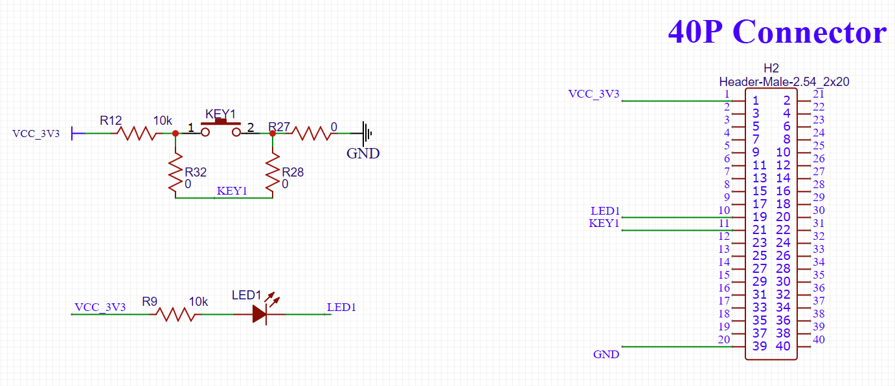

# 动态设备树GPIO控制LED

通过使用动态改变设备树，使用内核gpio-poweroff驱动实现LED控制

## 参考文档

* [Device Trees, overlays, and parameters](https://www.raspberrypi.org/documentation/configuration/device-tree.md)
  * 2.2: Device Tree parameters
* [Raspberry Pi overlays README](https://github.com/raspberrypi/firmware/blob/master/boot/overlays/README)
  * gpio-poweroff

## 原理图  



## 实践操作

* sudo cat /sys/kernel/debug/gpio
  ```
  gpiochip0: GPIOs 0-53, parent: platform/fe200000.gpio, pinctrl-bcm2835:
   gpio-0   (ID_SDA              )
   gpio-1   (ID_SCL              )
   gpio-2   (SDA1                )
   gpio-3   (SCL1                )
   gpio-4   (GPIO_GCLK           )
   gpio-5   (GPIO5               )
   gpio-6   (GPIO6               )
   gpio-7   (SPI_CE1_N           )
   gpio-8   (SPI_CE0_N           )
   gpio-9   (SPI_MISO            )
   gpio-10  (SPI_MOSI            )
  ...省略
  ```
* 加载设备树及驱动：
  * /boot/config.txt
    * 末尾添加：`dtoverlay=gpio-poweroff,gpiopin=10,export=1`
    * 需要重启生效
  * sudo dtoverlay gpio-poweroff gpiopin=10 export=1
    * 这种方式存在问题，overlay文件系统不生效以后，重启的时候，电平拉不上去，暂不深入解释，自行理解分析
* sudo cat /sys/kernel/debug/gpio
  ```
  gpiochip0: GPIOs 0-53, parent: platform/fe200000.gpio, pinctrl-bcm2835:
   gpio-0   (ID_SDA              )
   gpio-1   (ID_SCL              )
   gpio-2   (SDA1                )
   gpio-3   (SCL1                )
   gpio-4   (GPIO_GCLK           )
   gpio-5   (GPIO5               )
   gpio-6   (GPIO6               )
   gpio-7   (SPI_CE1_N           )
   gpio-8   (SPI_CE0_N           )
   gpio-9   (SPI_MISO            )
   gpio-10  (SPI_MOSI            |power_ctrl          ) out lo
  ...省略
  ```
* sudo reboot
* sudo shutdown now
* sudo su
  * cd /sys/class/gpio/gpio10
  * echo 1 > value
  * echo 0 > value
  * 引出一个新的问题：用户空间原来可以这个控制GPIO口

## overlay分析

* arch/arm/boot/dts/overlays/gpio-poweroff-overlay.dts
  ```dts
  // Definitions for gpio-poweroff module
  /dts-v1/;
  /plugin/;
  
  / {
          compatible = "brcm,bcm2835";
  
          fragment@0 {
                  target-path = "/";
                  __overlay__ {
                          power_ctrl: power_ctrl {
                                  compatible = "gpio-poweroff";
                                  gpios = <&gpio 26 0>;
                                  force;
                          };
                  };
          };
  
          fragment@1 {
                  target = <&gpio>;
                  __overlay__ {
                          power_ctrl_pins: power_ctrl_pins {
                                  brcm,pins = <26>;
                                  brcm,function = <1>; // out
                          };
                  };
          };
  
          __overrides__ {
                  gpiopin =       <&power_ctrl>,"gpios:4",
                                  <&power_ctrl_pins>,"brcm,pins:0";
                  active_low =    <&power_ctrl>,"gpios:8";
                  input =         <&power_ctrl>,"input?";
                  export =        <&power_ctrl>,"export?";
                  timeout_ms =    <&power_ctrl>,"timeout-ms:0";
          };
  };
  ```

## 驱动分析

* drivers/power/reset/gpio-poweroff.c

