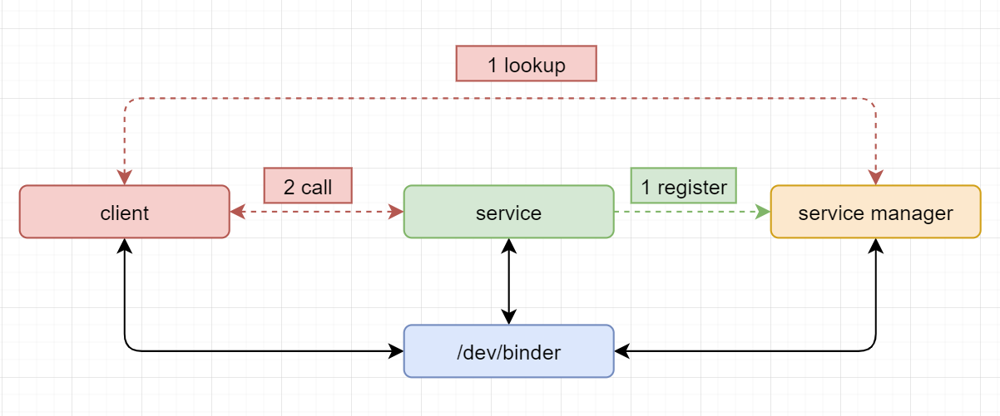

# Android Binder通信

在树莓派中理解Android Binder通信

## 参考文档

* https://github.com/hungys/binder-for-linux
* [0005_内核编译.md](0005_内核编译.md)

## 内核支持Binder

* make menuconfig
  ```
   .config - Linux/arm 5.4.83 Kernel Configuration
   → Device Drivers → Android ───────────────────────────────────────────────────
    ┌──────────────────────────────── Android ────────────────────────────────┐
    │  Arrow keys navigate the menu.  <Enter> selects submenus ---> (or empty │
    │  submenus ----).  Highlighted letters are hotkeys.  Pressing <Y>        │
    │  includes, <N> excludes, <M> modularizes features.  Press <Esc><Esc> to │
    │  exit, <?> for Help, </> for Search.  Legend: [*] built-in  [ ]         │
    │ ┌─────────────────────────────────────────────────────────────────────┐ │
    │ │    [*] Android Drivers                                              │ │
    │ │    [*]   Android Binder IPC Driver                                  │ │
    │ │    [ ]     Android Binderfs filesystem                              │ │
    │ │    (binder,hwbinder,vndbinder) Android Binder devices               │ │
    │ │    [ ]     Android Binder IPC Driver Selftest                       │ │
    │ │                                                                     │ │
    │ │                                                                     │ │
    │ │                                                                     │ │
    │ │                                                                     │ │
    │ └─────────────────────────────────────────────────────────────────────┘ │
    ├─────────────────────────────────────────────────────────────────────────┤
    │        <Select>    < Exit >    < Help >    < Save >    < Load >         │
    └─────────────────────────────────────────────────────────────────────────┘
  ```
  * [Device Drivers] -> [Android]
* KERNEL=kernel7l
* make -j4 zImage
  ```
  scripts/kconfig/conf  --syncconfig Kconfig
    CALL    scripts/atomic/check-atomics.sh
    CALL    scripts/checksyscalls.sh
    CHK     include/generated/compile.h
    CC      drivers/android/binder.o
    CC      drivers/android/binder_alloc.o
    AR      drivers/android/built-in.a
    AR      drivers/staging/android/ion/built-in.a
    AR      drivers/staging/android/built-in.a
    AR      drivers/staging/built-in.a
    AR      drivers/built-in.a
    GEN     .version
    CHK     include/generated/compile.h
    UPD     include/generated/compile.h
    CC      init/version.o
    AR      init/built-in.a
    LD      vmlinux.o
    MODPOST vmlinux.o
    MODINFO modules.builtin.modinfo
    LD      .tmp_vmlinux.kallsyms1
    KSYM    .tmp_vmlinux.kallsyms1.o
    LD      .tmp_vmlinux.kallsyms2
    KSYM    .tmp_vmlinux.kallsyms2.o
    LD      vmlinux
    SORTEX  vmlinux
    SYSMAP  System.map
    OBJCOPY arch/arm/boot/Image
    Kernel: arch/arm/boot/Image is ready
    GZIP    arch/arm/boot/compressed/piggy_data
    AS      arch/arm/boot/compressed/piggy.o
    LD      arch/arm/boot/compressed/vmlinux
    OBJCOPY arch/arm/boot/zImage
    Kernel: arch/arm/boot/zImage is ready
  ```
* sudo cp arch/arm/boot/zImage /boot/$KERNEL.img
* sudo sync
* sudo reboot
* ls -al /dev/*binder
  ```
  crw------- 1 root root 10, 61 Mar  5 13:02 /dev/binder
  crw------- 1 root root 10, 60 Mar  5 13:02 /dev/hwbinder
  crw------- 1 root root 10, 59 Mar  5 13:02 /dev/vndbinder
  ```
* [Binder示例代码](https://github.com/LowLevelOfLogic/RaspberryPi/tree/servicemanager)
  * make
* sudo ./servicemanager
* bctest
  * sudo ./bctest publish zengjf
  * sudo ./bctest lookup zengjf
* 函数调用：
  * sudo ./service
  * sudo ./bctest lookup calculate
  * sudo ./client a 110  
* 

## Android中bctest补丁

新的Android版本的bctest没有更新，需要加一些代码才能正常使用

```diff
diff --git a/frameworks/native/cmds/servicemanager/bctest.c b/frameworks/native/cmds/servicemanager/bctest.c
index 354df670e54..782bf29e958 100644
--- a/frameworks/native/cmds/servicemanager/bctest.c
+++ b/frameworks/native/cmds/servicemanager/bctest.c
@@ -16,6 +16,7 @@ uint32_t svcmgr_lookup(struct binder_state *bs, uint32_t target, const char *nam

     bio_init(&msg, iodata, sizeof(iodata), 4);
     bio_put_uint32(&msg, 0);  // strict mode header
+    bio_put_uint32(&msg, 0);
     bio_put_string16_x(&msg, SVC_MGR_NAME);
     bio_put_string16_x(&msg, name);

@@ -40,6 +41,7 @@ int svcmgr_publish(struct binder_state *bs, uint32_t target, const char *name, v

     bio_init(&msg, iodata, sizeof(iodata), 4);
     bio_put_uint32(&msg, 0);  // strict mode header
+    bio_put_uint32(&msg, 0);
     bio_put_string16_x(&msg, SVC_MGR_NAME);
     bio_put_string16_x(&msg, name);
     bio_put_obj(&msg, ptr);
@@ -93,9 +95,12 @@ int main(int argc, char **argv)
                 fprintf(stderr,"argument required\n");
                 return -1;
             }
+            fprintf(stderr,"published: [%s]\n", argv[1]);
             svcmgr_publish(bs, svcmgr, argv[1], &token);
             argc--;
             argv++;
+
+            while(1);
         } else {
             fprintf(stderr,"unknown command %s\n", argv[0]);
             return -1;
```