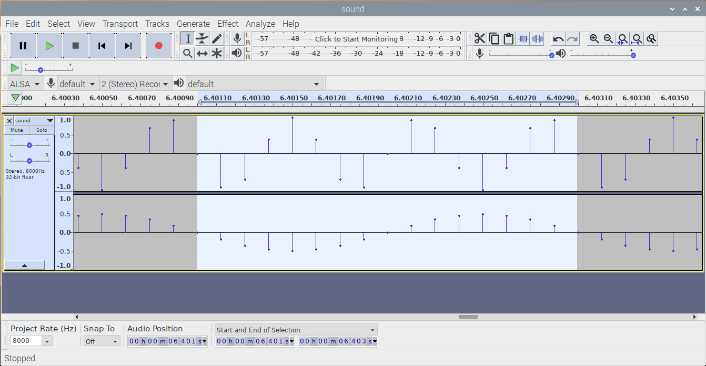

# wav声音PCM数据分析

通过wav文件了解PCM数据

## steps

* apt-cache search audacity
  ```
  audacity - fast, cross-platform audio editor
  audacity-data - fast, cross-platform audio editor (data)
  debian-edu-doc-en - English documentation from the Debian Edu project
  debian-edu-doc-fr - French documentation from the Debian Edu project
  debian-edu-doc-nb - Bokmål documentation from the Debian Edu project
  debian-edu-doc-nl - Dutch documentation from the Debian Edu project
  debian-edu-doc-zh - Chinese documentation from the Debian Edu project
  forensics-extra-gui - Forensics Environment - extra GUI components (metapackage)
  silan - commandline tool to detect silence in audio-files
  vamp-plugin-sdk - audio analysis and feature extraction plugins (SDK)
  ```
* sudo apt-get install audacity
* [示例源代码](https://github.com/ZengjfOS/RaspberryPi/tree/wavefile)
  * make
* 设置为耳机输出声音，注意关闭远程桌面进行设置：sudo rasp-config
  * System Options
    * Audio
      * 0 Headphones
* ./wavfile
  * sound.wav
  * 声音有点难受
* aplay sound.wav
* 远程桌面打开：audacity
  * sound.wav


