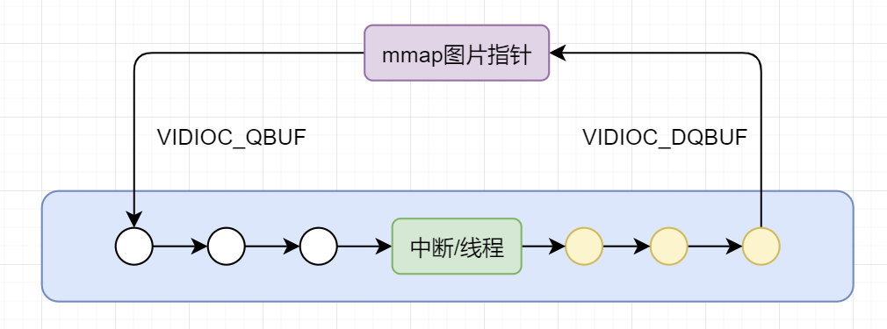

# 采用V4L2接口获取USB摄像头图片

C语言获取图片可以更好理解V4L2接口

## V4L2大体运作原理



* USB Camera是开线程获取图片；
* MIPI CSI在获取完一张图片之后会触发中断；

## Steps

* https://github.com/LowLevelOfLogic/RaspberryPi/tree/USBCameraCapture
  * make
* ./getCameraInfo
  ```
  Driver Name: uvcvideo
  Picture Format: Motion-JPEG
  width: 640 height: 480
  width: 320 height: 240
  width: 160 height: 120
  width: 176 height: 144
  ```
* ./getjpg
