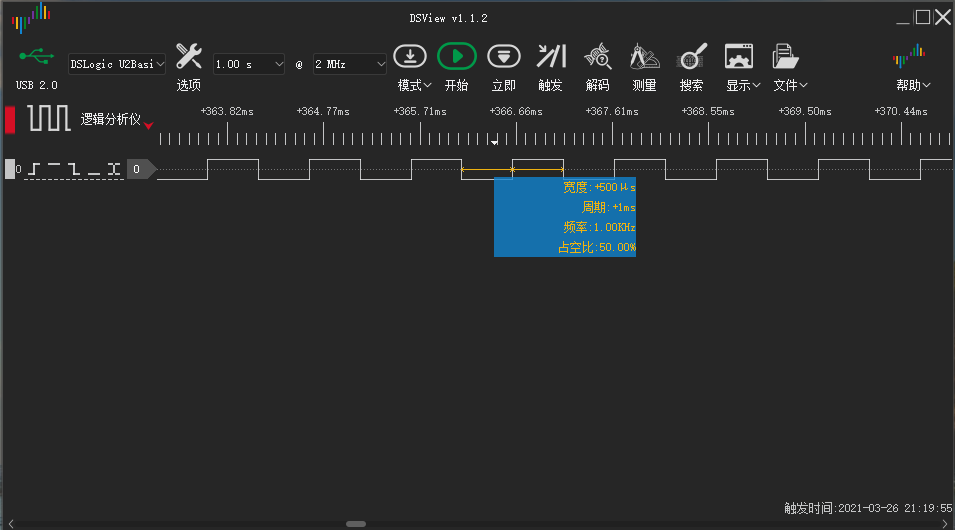

# 硬件PWM控制风扇

PWM控制风扇

## 参考文档

* https://www.kernel.org/doc/Documentation/pwm.txt

## pin

* https://datasheets.raspberrypi.org/bcm2711/bcm2711-peripherals.pdf
  * Chapter 5. General Purpose I/O (GPIO)
    * 5.3. Alternative Function Assignments
      * GPIO12

## dtbo

* arch/arm/boot/dts/overlays/pwm-overlay.dts
* arch/arm/boot/dts/overlays/README
  ```
  Name:   pwm
  Info:   Configures a single PWM channel
          Legal pin,function combinations for each channel:
            PWM0: 12,4(Alt0) 18,2(Alt5) 40,4(Alt0)            52,5(Alt1)
            PWM1: 13,4(Alt0) 19,2(Alt5) 41,4(Alt0) 45,4(Alt0) 53,5(Alt1)
          N.B.:
            1) Pin 18 is the only one available on all platforms, and
               it is the one used by the I2S audio interface.
               Pins 12 and 13 might be better choices on an A+, B+ or Pi2.
            2) The onboard analogue audio output uses both PWM channels.
            3) So be careful mixing audio and PWM.
            4) Currently the clock must have been enabled and configured
               by other means.
  Load:   dtoverlay=pwm,<param>=<val>
  Params: pin                     Output pin (default 18) - see table
          func                    Pin function (default 2 = Alt5) - see above
          clock                   PWM clock frequency (informational)
  ```
* /boot/config.txt
  ```
  dtoverlay=pwm,pin=12,func=4
  ```

## steps

* https://github.com/LowLevelOfLogic/RaspberryPi/tree/IP_Camera
  * python3 stream.py
  * http://192.168.3.8:5000/
* cd /sys/class/pwm/pwmchip0
* echo 0 > export
* ls
  ```
  capture  duty_cycle  enable  period  polarity  power  uevent
  ```
  * period  
    The total period of the PWM signal (read/write). Value is in nanoseconds and is the sum of the active and inactive time of the PWM.
  * duty_cycle  
    The active time of the PWM signal (read/write). Value is in nanoseconds and must be less than the period.
* cd pwm0
* echo 1000000 > period
* echo 500000 > duty_cycle
* echo 1 > enable  
  
  * 宽度：500us
  * 周期：1ms
  * 频率：1KHz
  * 占空比：50%
* 频率太低，能听到刺耳的声音，将频率拉高；
* echo 5000 > duty_cycle
* echo 10000 > period
  * 宽度：5us
  * 周期：10us
  * 频率：100KHz
  * 占空比：50%
* https://github.com/LowLevelOfLogic/RaspberryPi/tree/FanHAT
