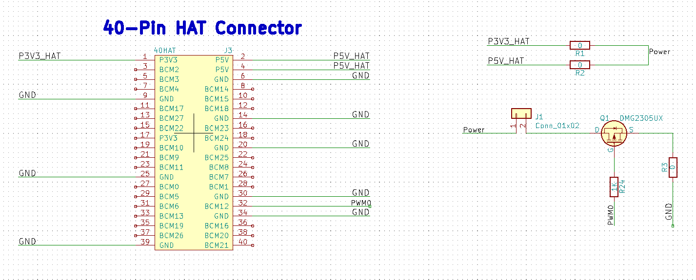
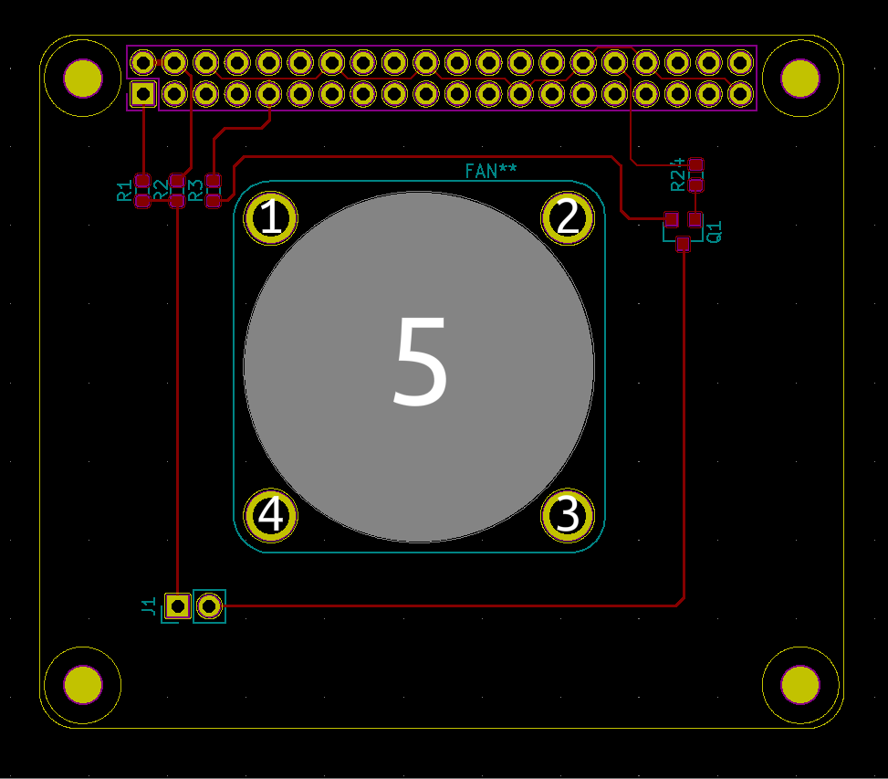

# 制作风扇扩展板FanHAT

KiCad制作风扇扩展板FanHAT

## 画板工具

* [立创EDA](https://lceda.cn/)
  * 网页版画图
* [KiCad EDA](https://kicad.org/)
  * 应用软件

## KiCad

* 有树莓派模板；
* 可以看CM4的扩展板设计，要最新的未发行的版本
  * [Compute Module and related schematics](https://www.raspberrypi.org/documentation/hardware/computemodule/schematics.md)
  * 因为这个原因学习的KiCad
* 和常用的其他的软件有差异，用起来可能有点不舒服，不过用惯了也就没什么感觉

## 打样

* https://github.com/LowLevelOfLogic/RaspberryPi/blob/FanHAT/hardware/FanHAT.zip
* 嘉立创
  * 一个月两次5元
* 捷配
  * 一个月一次免费

## FanHAT

* https://github.com/LowLevelOfLogic/RaspberryPi/tree/FanHAT/hardware
* [嘉立创 工艺参数](https://www.jlc.com/portal/vtechnology.html)
* 原理图  
  
* PCB  
  

## 关于器件封装

* 时间久了链接可能失效，自行提取链接文字检索
* [DC5V 3CM厘米 30MM 3007 超小迷你直流无刷散热小风扇3D打印机DIY](https://item.taobao.com/item.htm?spm=a1z0d.6639537.1997196601.112.71cb7484pxNBZk&id=42472157241)
  * 3007
* [尼龙铆钉按压式塑料铆钉R型 PC板铆钉塑胶卡扣塑料子母铆钉R3R4R5](https://detail.tmall.com/item.htm?id=19636269636&spm=a1z09.2.0.0.21db2e8doMpCGv&_u=bcfhpg2a75d)
  * R3080
* [【优信电子】贴片 SOT-23 AO3400 MOS场效应管 2.5A（20只）](https://item.taobao.com/item.htm?spm=a1z09.2.0.0.322b2e8dkeX7d8&id=522574089119&_u=bcfhpg29254)
  * SOT-23
* 电阻、电容
  * 0603
* 多犯几次错，不断积累经验，然后就做成了

## 工具

* 电烙铁
* 焊锡
* 镊子
* [黄花907调温电烙铁套装60W恒温烙铁家用 电脑维修焊接 烙铁套装](https://detail.tmall.com/item.htm?id=4766337579&spm=a1z09.2.0.0.322b2e8dkeX7d8&_u=bcfhpg2621c)
  * 只是给一个示例，购买根据自己情况

## 焊接技巧

* 理解锡高温熔化会产生表面张力，会把轻的元器件拉到位
* 要把一个器件卸下来，要多上锡，增加热熔，而不是把锡吸了，然后电烙铁在上面频繁来回倒腾，很容取下元其器件
  * 有热风枪就直接吹，省事
* 两个引脚焊锡连在一起了，也是多上锡，然后通过电烙铁拖锡的时候，可以很轻易的处理
  * 网上找点资料看看，我是跟以前硬件工程师学的
